# 关于我

你好，我是马凌峰。在高中时，一位朋友根据我名字的谐音给我起了一个外号——`Marlin`，我觉得这个外号不错，于是一直沿用至今。  
目前主要重心在算法竞赛上（但是很菜），因此主语言为 C++。  
平时会刷刷题，或者是基于 AI Coding 写一写小项目。  
有时候会写写博客，分享一些自己的想法。  
欢迎通过[邮箱](mailto:marlin_phone@outlook.com)或[Telegram](https://t.me/Marlin_Phone)联系我！  
我的博客：[Marlin's Blog](https://marlin-phone.github.io)  
了解更多的我：[About Me](https://marlin-phone.github.io/about)

<!-- 第一行：博客、邮箱、GitHub stars、GitHub followers -->

  
  
  
  
  

<!-- 使用容器分隔不同部分 -->

  <picture style="margin-right: 20px;">
    <source media="(prefers-color-scheme: dark)" srcset="badges/stats-dark.svg" />
    <source media="(prefers-color-scheme: light)" srcset="badges/stats-light.svg" />
    
  </picture>
  <picture>
    <source media="(prefers-color-scheme: dark)" srcset="badges/languages-dark.svg" />
    <source media="(prefers-color-scheme: light)" srcset="badges/languages-light.svg" />
    
  </picture>

  <picture>
    <source media="(prefers-color-scheme: dark)" srcset="dist/github-snake-dark.svg" />
    <source media="(prefers-color-scheme: light)" srcset="dist/github-snake.svg" />
    
  </picture>

<!-- 第二行：WakaTime 徽章 -->

  

<!-- 第三行：github-readme-stats WakaTime 徽章 -->

  

## 最近博客

<!-- BLOG-POST-LIST:START -->
- [并查集-上](https://marlin-phone.github.io/2025/08/18/%E5%B9%B6%E6%9F%A5%E9%9B%86-%E4%B8%8A/)
- [N皇后问题-位运算](https://marlin-phone.github.io/2025/08/16/N%E7%9A%87%E5%90%8E%E9%97%AE%E9%A2%98-%E4%BD%8D%E8%BF%90%E7%AE%97/)
- [Git使用与代理](https://marlin-phone.github.io/2025/08/14/git%E4%BD%BF%E7%94%A8%E4%B8%8E%E4%BB%A3%E7%90%86/)
- [常见经典递归总结](https://marlin-phone.github.io/2025/08/14/%E5%B8%B8%E8%A7%81%E7%BB%8F%E5%85%B8%E9%80%92%E5%BD%92%E6%80%BB%E7%BB%93/)
- [根据数据量猜解法的技巧](https://marlin-phone.github.io/2025/08/13/%E6%A0%B9%E6%8D%AE%E6%95%B0%E6%8D%AE%E9%87%8F%E7%8C%9C%E8%A7%A3%E6%B3%95/)
<!-- BLOG-POST-LIST:END -->
